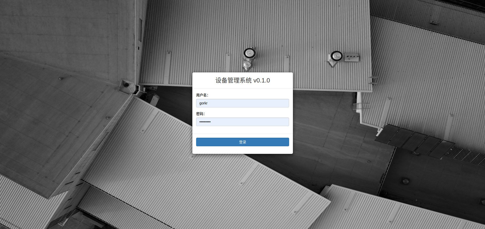
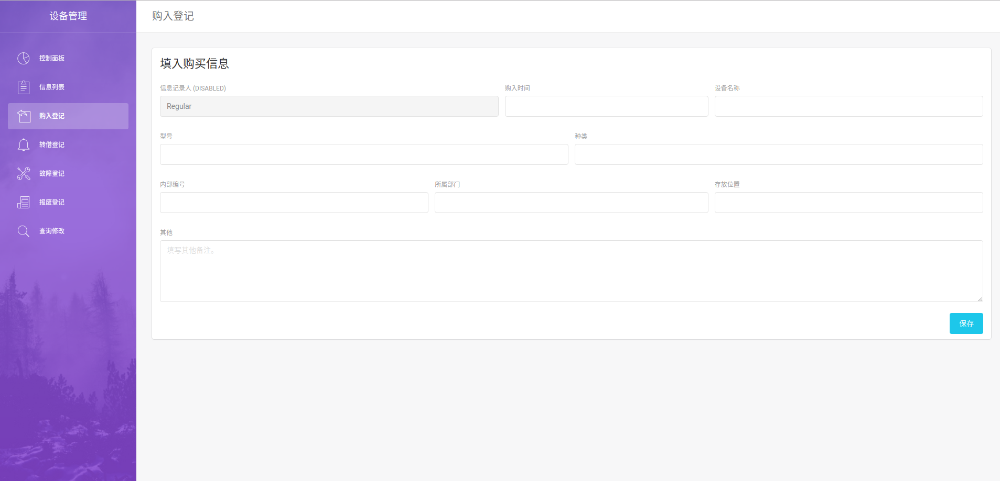
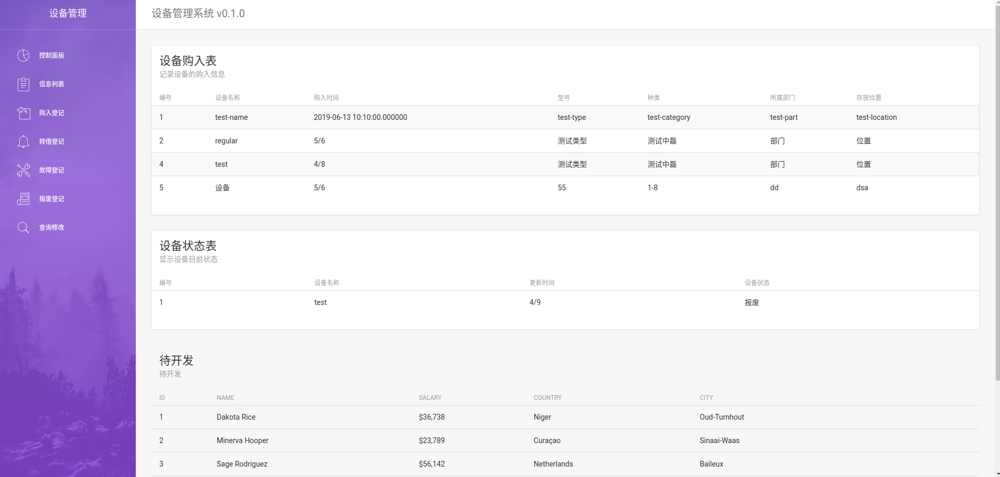

# 实验要求

设备管理系统

实现公司设备的有效管理、维护记录。

- 购入新设备，登记设备购入时间、名称、型号、种类、内部编号、所属部门、存放位置等。
- 设备转借时，记录借用部门、经手人员、用途、拟还日期等。
- 设备故障时，记录故障情况、维修情况（时间、人员、结果）等。
- 设备报废时，记录报废原因、批准人员、经手人员、处理方式等。

对设备管理人员和使用人员提供各种设备处理的按部门、设备类型、处理日期等查询和修改等功能。

# 实现

实现了登录，购入 子系统。

# 界面

